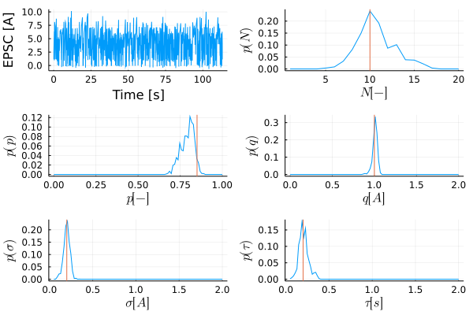

# BinomialSynapses

[](https://buildkite.com/theoretical-neuroscience-group/binomialsynapses)
[](https://codecov.io/gh/Theoretical-Neuroscience-Group/BinomialSynapses.jl)

## Installation

To install this package in Julia 1.5 or 1.6, type

```julia
]add https://github.com/Theoretical-Neuroscience-Group/BinomialSynapses.jl
```

## Usage

User API is work in progress. This is a minimal working example for running the nested particle filter on synthetic data and producing a plot of the observation trace and the posterior histograms.
```julia
using BinomialSynapses

sim = NestedFilterSimulation(
        10, 0.85, 1.0, 0.2, 0.2,   # ground truth parameters
        1:20,                      # parameter ranges for filter
        LinRange(0.05, 0.95, 100), # .
        LinRange(0.10, 2.00, 100), # .
        LinRange(0.05, 2.00, 100), # .
        LinRange(0.05, 2.00, 100), # .
        2048, 512,                 # outer and inner number of particles
        12                         # jittering kernel width
      )

times, epsps = run!(sim, T = 1000)

posterior_plot(sim.fstate, times, epsps, truemodel = sim.hmodel)
```


